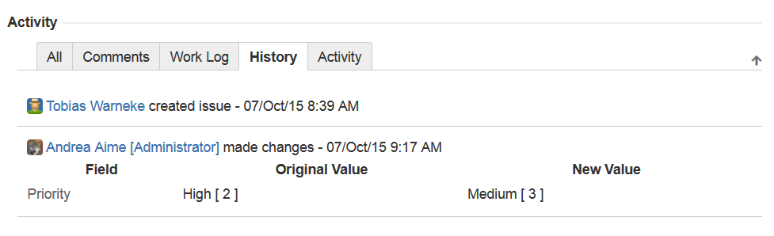
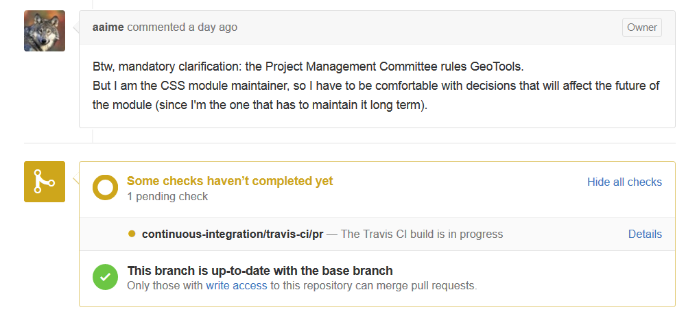

# Requirements

## Indice
- [Requirements](#requirements)                                
	- [Development Requirements](#development-requirements)
	- [Features](#features)
	- [Elicitation](#elicitation)
	- [Specification and Analysis](#specification-and-analysis)
	- [Validation](#validation)
	- [Use cases](#use-cases)

##Development Requirements

Para o Geotools funcionar são necessários dois programas em específico. Um deles é o [Apache Maven](http://maven.apache.org/download.html) (versão 3.2.1) que é uma ferramenta de compilação utilizada primariamente em projetos Java. O outro é [Java 2 Software Developers Kit](http://www.oracle.com/technetwork/java/javase/overview/index.html) (Java 7) que é a biblioteca da Oracle para desenvolver projetos com a linguagem Java.

## Features

Como o Geotools já é um projeto em desenvolvimento há algum tempo [e portanto já tem várias versões released](http://geotools.org/about.html), pelo que a maior parte dos requerimentos são melhoramentos ao código existente. Apesar disso, o programa tem sempre de seguir certos standards que constam da sua [página de features](http://docs.geotools.org/latest/userguide/geotools.html), e sem que o código establecido seja quebrado.

##Elicitation

Tal como ocorre com o reportar de erros, os pedidos de novas funcionalidades do geotools é feito atravéz do [Issue Tracker JIRA](https://osgeo-org.atlassian.net/projects/GEOT/summary). É possivel encontrar especificamente apenas os pedidos de funcionalidades atravez da filtragem em [New Feature, Improvement e Task](https://osgeo-org.atlassian.net/browse/GEOT-5186?jql=project%20%3D%20GEOT%20AND%20issuetype%20in%20%28Improvement%2C%20%22New%20Feature%22%2C%20Task%29%20ORDER%20BY%20priority%20DESC%2C%20updated%20DESC) e finalmente, marcar apenas problemas em estado aberto ‘Open’.

Em alternativa, há sempre a possibilidade de comunicar para [uma das mailing lists do projecto](http://geotools.org/getinvolved.html), sendo que outrem poderá abrir uma Issue no tracker se a sugestão for relevante.

##Specification and Analysis

Qualquer pessoa pode fazer uma request e qualquer pessoa pode participar da discussão. Os pedidos devem  O tracker tem uma secção de atividade que incorpora essa vertentes.  

Caso não existam conflictos, o problema pode ser aprovado o que normalmente involve alguém do Project Management Committee decidir um utilizador que se torna o Asignee da alteração, possivelmente um dos próprios ou alguém que se voluntarie nos comentários.

##Validation

Após a alteração ser aprovada, é feito o seu desenvolvimento. Dependendo da alteração, o grupo de utilizadores que tem a responsabilidade de a desenvolver ocorre de forma hierarquica  consoante [o guia de contribuição](http://docs.geotools.org/latest/developer/procedures/contribute.html) ( Contributors < Commiters < Module Maintainers).  Para alterações muito grandes, que alteram as funções existentes dos módulos, o processo de desenvolvimento deve ser registrado na Wiki do Geotools como uma págna de Change Proposal, que contem informação, para alem de alguma em parte duplicada do JIRA, adicional relativa a alterações de API, documentação. É tambem feita uma votação entre developers do Project Management Committee.

No final, todas as alterações devem ser feitas atravéz pull request [no github](https://github.com/geotools/geotools/pulls). Os próprios pull request [tem as suas regras](http://docs.geotools.org/latest/developer/procedures/pull_requests.html), incluindo referência cruzada com o issue no JIRA e exemplos de casos de teste. No JIRA é possivel encontrar quem é ou foi o responsável ‘Assignee ‘ pelo problema marcado.

Mas mesmo feito um Pull Request, não é garantido que o problema seja acrescentado a master até ser feita a sua validação. Quando o Module Maintainer sentir que o seu módulo está pronto, pode decidir declará-lo formalmente supported, momento esse em que o módulo é transferido para o directório modules/plugin/ ou modules/extension/.
	

##Use Cases
